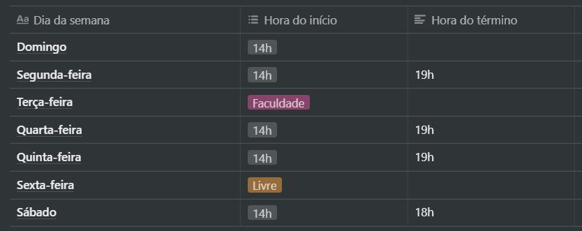
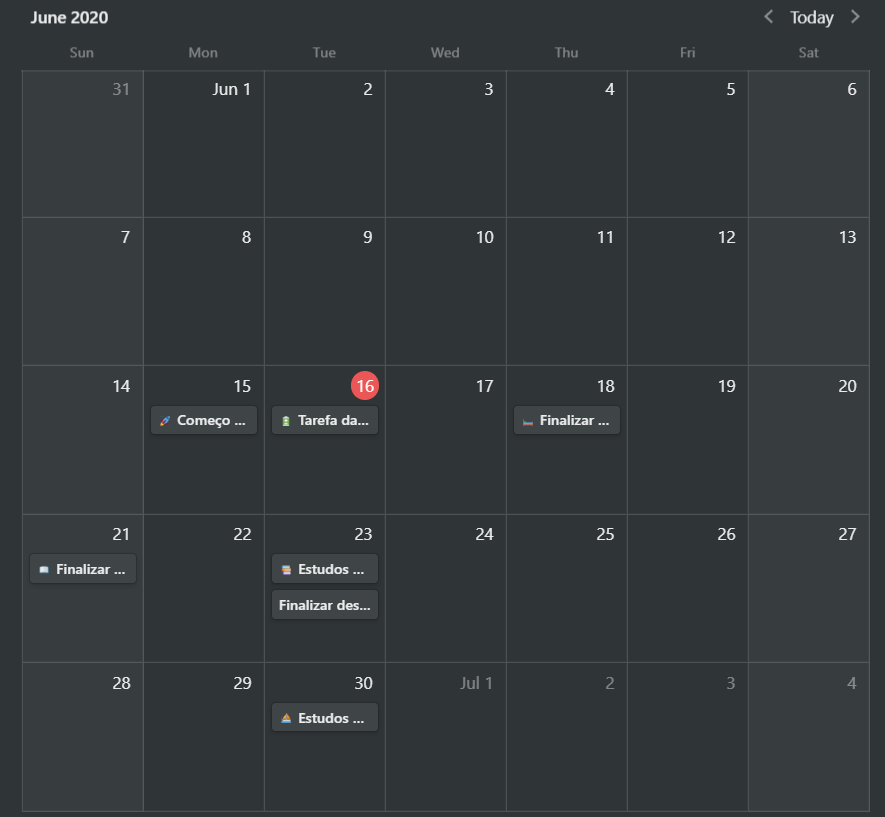

<h3 align="center">
  Desafio 1
</h3>

## :rocket: Planejando meus estudos

### Meu cronograma semanal

  

### Cronograma diário

  

## :memo: Licença

Esse projeto está sob a licença MIT. Veja o arquivo [LICENSE](LICENSE) para mais detalhes.

---

Feito com 💜 by Rocketseat :wave: [Entre na nossa comunidade!](https://discordapp.com/invite/gCRAFhc)
